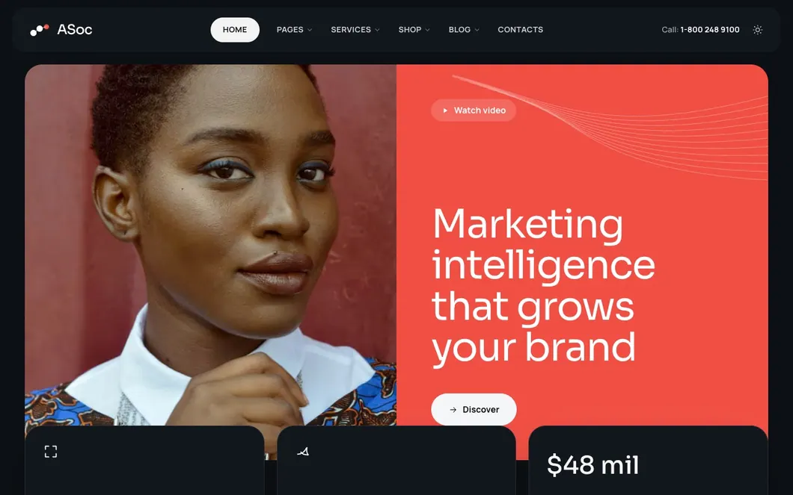
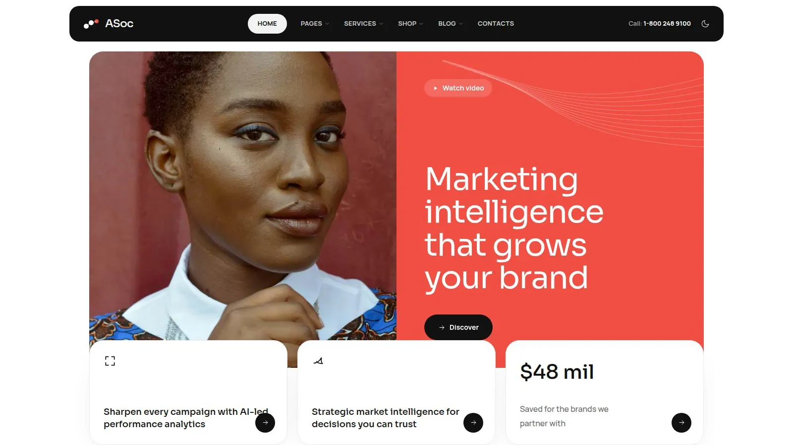
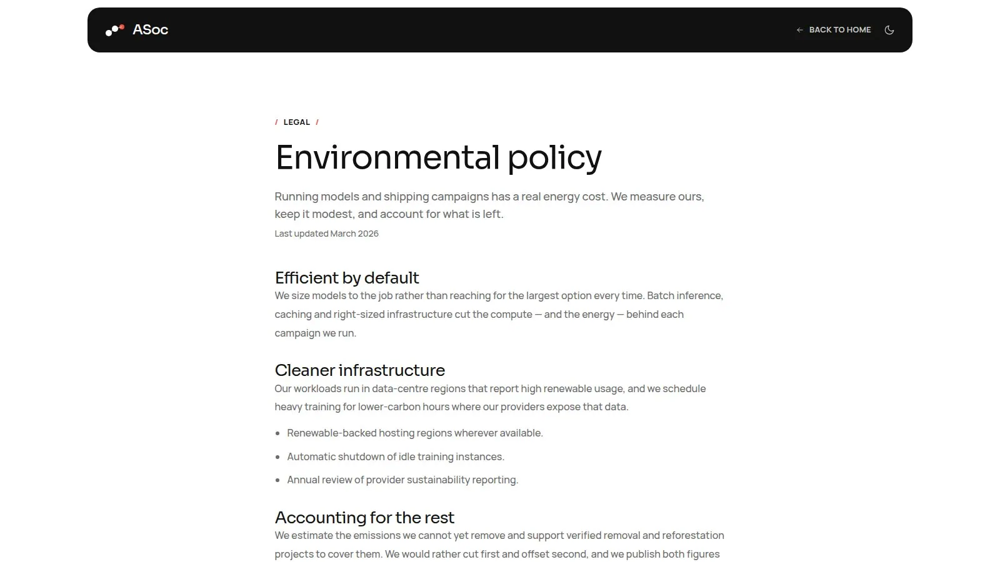
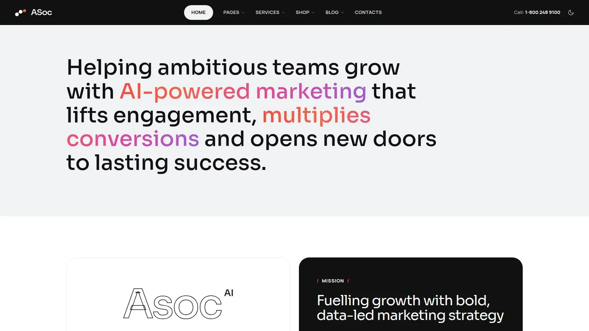
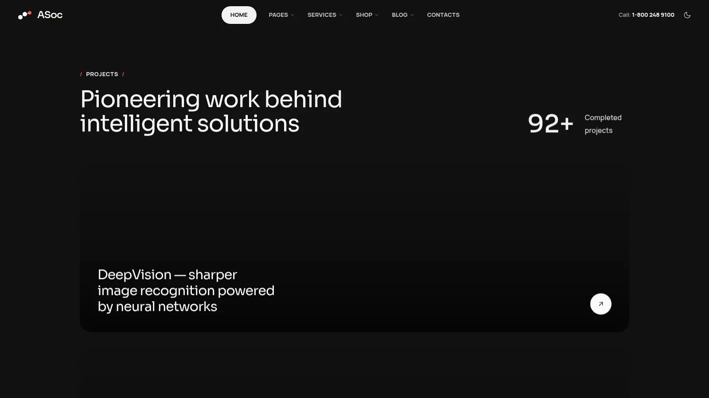

# ASoc Reach — Free HTML Landing Page Template (Tailwind CSS)

An AI-marketing agency landing page — services, achievements, projects and team.



**[Live demo & full edition →](https://asoctemplates.com/templates/asoc-reach-landing)**

## What's included

This repo is the free starter: 1 page of ASoc Reach, MIT licensed.

- **Home** (hero, about, services — the full page has 10 sections) — `pages/index.html`

It is a working Vite project, not a folder of exported HTML — clone it and `npm run dev`. Links to pages outside this starter open the full edition's live demo.

## Quick start

```bash
npm install
npm run dev      # http://localhost:5173
npm run build    # static site in dist/
```

`dist/` is the deliverable: upload it to any static host, or drop the pages into
Laravel, Rails, Django, .NET, Go or WordPress.

**More from the full edition:**






## What's in the full edition

ASoc Reach markets an AI-driven marketing agency: a hero with performance-analytics messaging, an achievements band ($50M+ revenue, 98% satisfaction, 1,000+ campaigns), and an eight-item AI services grid (image synthesis, style transfer, super-resolution, restoration and more). Projects showcase, team profiles, blog and contact round out the funnel.

The full 5-page edition includes:

- Hero with marketing-analytics messaging
- Achievements / results band
- 8-item AI services grid
- Projects showcase & team profiles
- Blog & contact sections

**[Get ASoc Reach →](https://asoctemplates.com/templates/asoc-reach-landing)**

## Tech

- **Tailwind CSS v4** — CSS-first config, no `tailwind.config.js` to fight.
- **Vanilla JS** — one small module per behaviour, no jQuery, no framework.
- **Vite** — dev server and static build.
- **Light & dark** — class-based, applied before first paint, no flash.

## Licence

The code in this repository is **MIT** — see [LICENSE](LICENSE). Use it in
commercial work, no attribution required.

The full ASoc Reach edition is not MIT; it ships under the
[ASoc licence](https://asoctemplates.com/license).

### Images

Photographs are hotlinked from [Unsplash](https://unsplash.com) under the
Unsplash licence and are **not covered by the MIT grant**. Swap them for your own
before shipping to production.
